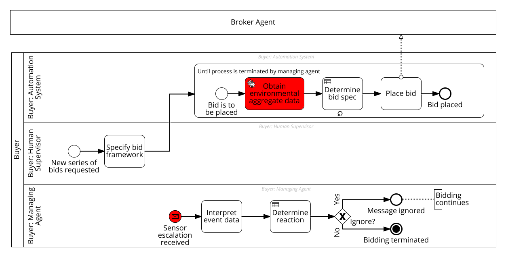

# Agent-based Business Process Orchestration for IoT - Proof-of-Concept Example
This repository contains a proof-of-concept example implementation for the paper *Agent-based Business Process Orchestration for IoT*.

## Scenario
The scenario the example covers deals with the semi-automatic procurement of wooden parts for specialist tools.

The process is triggered by an autonomous agent when the stock of this production input part is below a specified threshold.
To detect this, the agent can rely on a set of IoT sensors (cameras), that are *mocked* as an Node.js OM-I clients in this example.
The agent also uses heat and moisture sensors to inform the initial bid specification parameters accordingly.
It registers the bid specification with a business process execution engine (the specification triggers the process).

The bid specification is then reviewed and possibly enhanced by a human.
Subsequently, the process execution engine starts a loop that automatically updates the bid specification based on the latest sensor data from storage and production environment, and then registers bids for the to-be-procured good with an external broker agent\footnote{We assume the goods are hard to obtain and continuously placing bids is unlikely to cause over-procurement.}.

If the agent's sensors register an anomaly in the production line environment, the agent interprets the received sensor data to assess whether the bidding should be stopped. If so, the process is terminated.



Note that we replaced the human task *Specify bid framework* with an automated task; absolving human tasks requires users to authenticate and open the GUI of the workflow engine.
This change enables you to run the full example straight from the command line.

## Requirements
The the example requires the following software to be installed on your local machine:

* [Java 8](https://www.oracle.com/technetwork/java/javase/downloads/jre8-downloads-2133155.html);

* [Node.js](https://nodejs.org/en/);

* [Docker](https://www.docker.com/).

Note that in addition, the example interacts with a set of cloud applications:

* [Signavio Workflow Accelerator](https://www.signavio.com/products/workflow-accelerator/), a *low code* business process execution engine;

* [Google Spreadsheets](https://docs.google.com/spreadsheets/), which is used as a low-tech database;

* [Google Cloud Functions](https://cloud.google.com/functions) to host agents and messaging interfaces.

The code/artifacts that have been deployed to these services are available in the [artifacts](./artifacts) folder of this repository.

## Running the Example
To run the example, proceed as follows:

1. Download the content of this repository, for example by executing ``git clone git@github.com:TimKam/agent-based-process-orchestration-iot.git``.

2. Install the Node.js dependencies by executing ``npm install`` in the repository's root directory.

3. Make sure Docker is running.

4. Prepare the Docker container as follows:

    a. Get the OM-I server's docker image:

    ´´´
    docker pull aaltoasia/o-mi
    ´´´

    b. Run the Docker image and expose it via your machine's IP address:
    ```
    docker run -d --net=host -p 127.0.0.1:8080:8080  aaltoasia/o-mi
    ```

    c. Get the Docker container's ID:

    ```
    docker ps -l
    ```

    Copy the container ID. We will refer to it in the instructions below as ``<container ID>``.

    d. Login to the container via the command line:
    ```
    docker exec -it <container ID> bash
    ```

    e. Update the OM-I server's configuration:

    ```
    sed 's/"call"/"call", "write"/' conf/application.conf > conf/application.conf.changed && mv conf/application.conf.changed conf/application.conf
    ```

    f. Check if the changes were actually saved to the file:
    ```
    cat conf/application.conf | grep -i allowRequestTypesForAll
    ```

    g. Leave the docker image by executing ``exit``.

    h. Update the container image:

    ```
    docker commit <container ID> aaltoasia/o-mi
    ```

    i. Restart the container:

    ```
    docker restart <container ID>
    ```

5. Start the orchestrator by executing ``node orchestrator.js <your-docker-ip-address>`` (replace ``<your-docker-ip-address>`` with the IP address of your docker deamon) in the repository's root directory.

6. Open the dashboard that visualizes the interaction between agents, IoT device mocks, and business process engine. The dashboard is available at [dashboard/index.html](./dashboard/index.html).

## Authors

* Timotheus Kampik - [@TimKam]
* Avleen Malhi

## Acknowledgements
This work was partially supported by the Wallenberg AI, Autonomous Systems and Software Program (WASP) funded by the Knut and Alice Wallenberg Foundation and partially funded by the German Federal Ministry of Education and Research (BMBF) within the Framework Concept ”Industrie 4.0 – Kollaborationen in dynamischen Wertschöpfungsnetzwerken (InKoWe)”.

## License
This repository is made available under the [MIT license](./LICENSE).